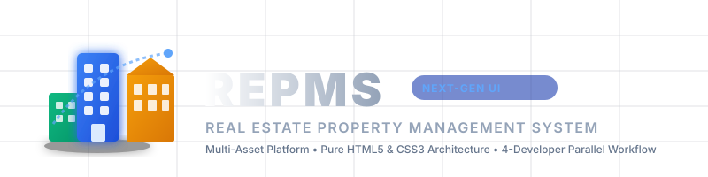

<p align="center">
  
</p>

<p align="center">
  <strong>A Next-Generation, Multi-Asset Real Estate Property Management Platform UI</strong>
</p>

<p align="center">
  
  
  
  
  
</p>

---

## 📌 Executive Overview

**REPMS** (**R**eal **E**state **P**roperty **M**anagement **S**ystem) is an enterprise-grade, high-density web application UI designed to streamline operations across all major real estate asset classes. 

Built strictly with **HTML5 and CSS3** (utilizing Design Tokens, CSS Custom Properties, and the BEM Naming Convention), REPMS provides a production-grade visual prototype engineered for zero CSS collisions when developed concurrently by a team of **4 HTML/CSS developers**.

---

## 🏢 Multi-Asset Class Coverage

REPMS is engineered to manage diverse real estate portfolios within a single unified dashboard:

- 🏠 **Residential & Multi-Family:** Apartments, Condos, Gated Communities, Single-Family Homes.
- 🏢 **Commercial Office Towers:** Class-A Offices, Co-Working Spaces, Corporate Campuses.
- 🛍️ **Retail Malls & Shopping Centers:** Strip Malls, Anchor Outlets, Retail Kiosks.
- 🏭 **Industrial Logistics Parks:** Warehouses, Distribution Centers, Cold Storage Facilities.
- 🏬 **Mixed-Use Developments:** Integrated Retail-Residential-Office Towers.
- 🏕️ **Vacant Land & Plots:** Commercial Zoned Land, Land Leases, Development Sites.

---

## 🚀 Key Functional Modules

| Module | Icon | Description | Owner |
| :--- | :---: | :--- | :--- |
| **Executive Master Dashboard** | 📊 | Real-time portfolio metrics, KPI summary cards, occupancy visualizer, emergency log. | Dev 1 |
| **Portfolio & Unit Stacker** | 🏙️ | Asset grid by property type, building floorplan visualizer, floor-by-floor unit stack. | Dev 1 |
| **Tenant Directory** | 👥 | Multi-tenant lookup, contact cards, active lease status, payment ledger summary. | Dev 2 |
| **Lease Lifecycle Management** | 📜 | Draft, active, and expiring leases, rent escalation schedules, security deposit escrows. | Dev 2 |
| **Financial Operations & Rent Roll** | 💰 | Net Operating Income (NOI) tracker, Rent Roll statements, pure CSS invoice generator modal. | Dev 3 |
| **Maintenance & Vendor Dispatch** | 🛠️ | Priority-based work order Kanban/List, contractor dispatch, SLA timers, vendor metrics. | Dev 3 |
| **Leasing CRM & Prospect Funnel** | 🔑 | Public/internal vacancy gallery, prospect application pipeline, tour scheduler. | Dev 4 |
| **Analytics & Executive ESG** | 🌿 | Property yield analytics, energy efficiency scorecards, carbon offset indices. | Dev 4 |

---

## 🏗️ 4-Developer Parallel CSS Architecture

To enable **4 developers to build simultaneously with ZERO CSS conflicts and zero git merge friction**, REPMS implements a strict **Layered CSS System**:

```
assets/css/tokens/primitives.css    <-- Raw CSS Variables (Colors, Spacing, Typography)
       │
       ▼
assets/css/tokens/semantic.css      <-- Purpose Intent Tokens (--color-brand-primary, --color-surface)
       │
       ▼
assets/css/base/reset.css & layout.css <-- Global Reset & Main App Shell Grid
       │
       ▼
assets/css/components/*.css        <-- Isolated BEM Components (Buttons, Tables, Cards, Modals)
       │
       ▼
assets/css/pages/*.css             <-- Page-Scoped Styles (.page-dashboard, .page-tenants, etc.)
       │
       ▼
assets/css/main.css                <-- Single Entry Import Aggregator
```

### 🔒 Conflict Prevention Rules:
1. **Scoped Page Namespaces:** Every page main container has a distinct scope class (e.g. `<main class="app-main page-financials">`). Page-specific styles in `assets/css/pages/financials.css` MUST be scoped inside `.page-financials`.
2. **BEM Naming Standard:** All reusable UI elements use BEM (Block-Element-Modifier): `.rep-card__title--active`.
3. **No Direct HTML Tag Styling:** Component styles rely exclusively on class names to prevent unintended global leaks.
4. **Pure CSS Interactivity:** Drawer overlays, filter tabs, and modal popups use pure CSS (`:hover`, `:focus-within`, `:checked`) to remain functional prior to JavaScript wiring.

---

## 📂 Repository File Structure

```
Mini project 2 REPMS/
├── index.html                      # Executive Master Dashboard (Dev 1)
├── IMPLEMENTATION_PLAN.md          # Detailed 4-Member Sprint Plan
├── README.md                       # Master Project Overview
├── pages/
│   ├── portfolio.html              # Asset Directory & Unit Stack (Dev 1)
│   ├── tenants.html                # Tenant Directory & Profiles (Dev 2)
│   ├── leases.html                 # Lease Agreements & Terms (Dev 2)
│   ├── financials.html             # Financial Operations & Rent Roll (Dev 3)
│   ├── maintenance.html            # Work Orders & Vendor Portal (Dev 3)
│   ├── leasing.html                # Vacancy Showcase & Lead CRM (Dev 4)
│   └── analytics.html              # Executive Analytics & ESG Reports (Dev 4)
└── assets/
    ├── images/
    │   └── logo.svg                # System Logo Banner
    └── css/
        ├── main.css                # Master CSS aggregator bundle
        ├── tokens/
        │   ├── primitives.css      # Design token primitives
        │   └── semantic.css        # Semantic intent tokens
        ├── base/
        │   ├── reset.css           # CSS Reset & normalization
        │   └── layout.css          # App Shell (Sidebar, Header, Main, Footer)
        ├── components/
        │   ├── buttons.css         # Button variants & interactive states
        │   ├── cards.css           # Metric & visual card components
        │   ├── tables.css          # High-density data tables
        │   ├── badges.css          # Status & priority badges
        │   ├── forms.css           # Inputs, search bars & filter dropdowns
        │   ├── modals.css          # Pure CSS drawers & modal popups
        │   ├── progress.css        # Capacity meters & ESG gauges
        │   └── charts.css          # Pure CSS visual charts
        └── pages/
            ├── dashboard.css       # Scoped styles for .page-dashboard
            ├── portfolio.css       # Scoped styles for .page-portfolio
            ├── tenants.css         # Scoped styles for .page-tenants
            ├── leases.css          # Scoped styles for .page-leases
            ├── financials.css      # Scoped styles for .page-financials
            ├── maintenance.css     # Scoped styles for .page-maintenance
            ├── leasing.css         # Scoped styles for .page-leasing
            └── analytics.css       # Scoped styles for .page-analytics
```

---

## 👥 4-Member Team Task Distribution (Group 15 - Section AB)

| Team Member | Module Ownership | Key Deliverables |
| :--- | :--- | :--- |
| **Shourya (Dev 1 - Lead Architect)** | App Shell & Dashboard / Portfolio | `base/reset.css`, `base/layout.css`, `index.html`, `pages/portfolio.html` |
| **Shikhar (Dev 2 - Tenant & Lease Lead)** | Tenant Directory & Lease Hub | `components/tables.css`, `badges.css`, `forms.css`, `pages/tenants.html`, `pages/leases.html` |
| **Shatakshi (Dev 3 - Finance & Operations)** | Financials & Maintenance | `components/cards.css`, `modals.css`, `charts.css`, `pages/financials.html`, `pages/maintenance.html` |
| **Shakti Dubey (Dev 4 - Leasing & ESG Analytics)** | Leasing CRM & Analytics | `components/progress.css`, `timeline.css`, `filters.css`, `pages/leasing.html`, `pages/analytics.html` |

---

## 🛠️ Quick Start / How to Run

Because REPMS is built purely with standard HTML5 and CSS3:

1. **Clone the Repository:**
   ```bash
   git clone https://github.com/VarshneysvAI/REPMS.git
   cd REPMS
   ```
2. **Open in Browser:**
   - Double click `index.html` or open with VS Code **Live Server** extension.

---

## 🤝 Git Workflow & Contribution Rules

- **Target Branch:** All feature work originates from `main` and is merged via Pull Requests.
- **Branch Naming:**
  - `feature/shell-and-dashboard` (Dev 1)
  - `feature/tenants-and-leases` (Dev 2)
  - `feature/financials-and-maintenance` (Dev 3)
  - `feature/leasing-and-analytics` (Dev 4)
- **Commit Messages:** Follow standard conventional commits (e.g. `feat: add rent roll table layout`, `fix: scope modal z-index`).

---

<p align="center">
  Made with ❤️ by the REPMS Engineering Team
</p>
